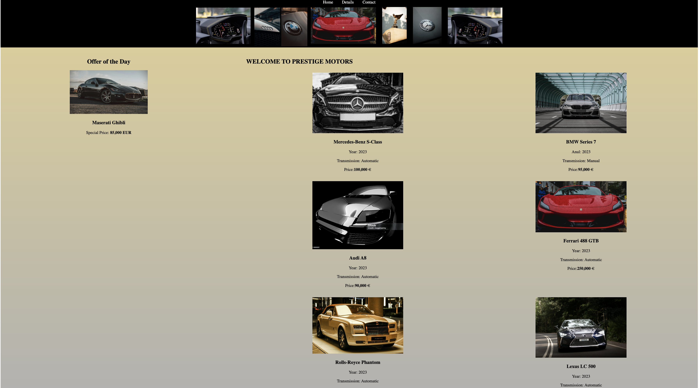
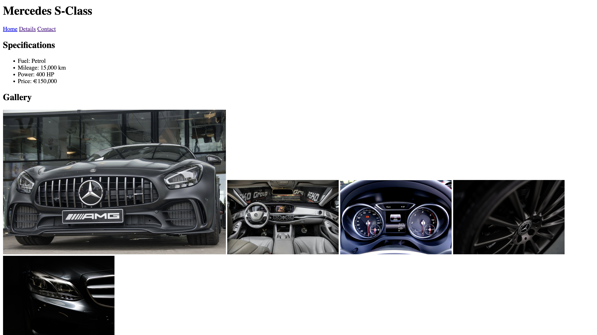

My first HTML project.

# 🚘 Prestige Motors

An elegant car showcase built entirely with **HTML5**, featuring premium vehicles, luxury details, and a smooth, visually pleasing layout.

## 🚗 Live Demo  
[Click to view the project](https://ileanacamelia.github.io/prestige-motors/)

---

## 🛠 Technologies Used  
- HTML5 (no CSS or JavaScript)

---

## 📂 Project Structure  
- `index.html` – Homepage with featured cars and offer of the day  
- `mercedes.html` – Dedicated page for the Mercedes S-Class, including detailed specifications and image gallery  
- `/images/` – Folder containing all car and gallery images  

---

## 🖼️ Preview

### Homepage
Displays premium cars with brand, year, transmission, and pricing information.

### Mercedes Detail Page
Full-width image gallery and detailed specifications for the Mercedes-Benz S-Class.

---

## 👩‍💼 Author  
**Camelia Cilioaica**  
Mallorca, Spain  
[cilioaica.camelia84@gmail.com](mailto:cilioaica.camelia@gmail.com)

---

> Hand-coded with precision. Focused on layout, clarity, and luxury presentation.

## Purpose
Beginner exercise to understand page structure, semantic tags, and basic HTML layout.

